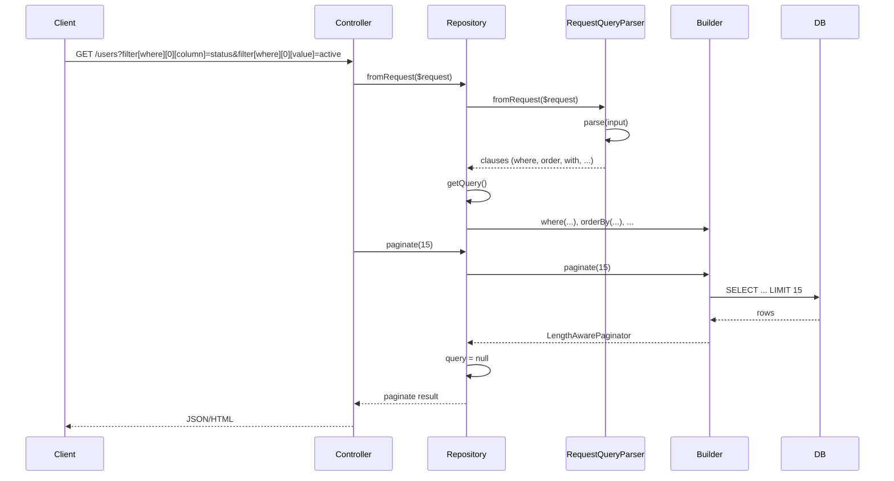
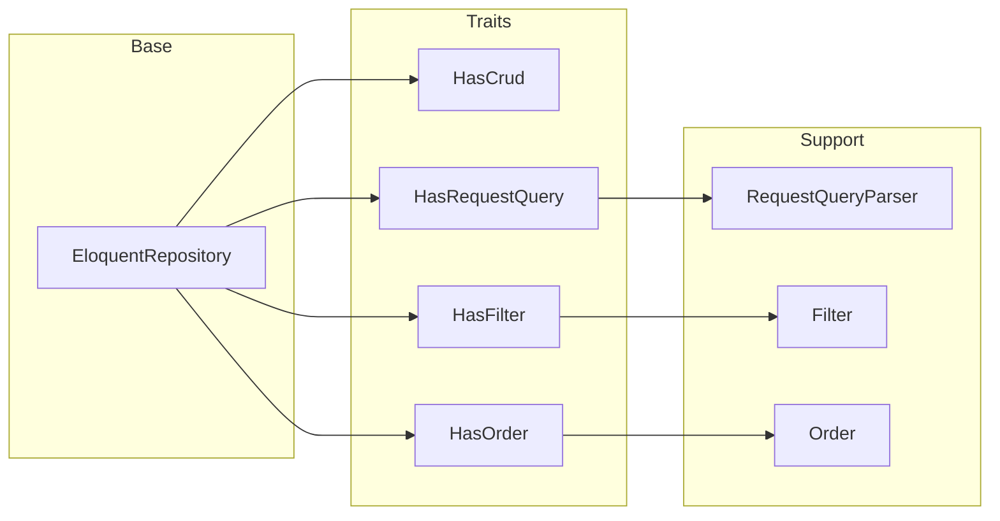

# Process & logic flow

## High-level flow

```
┌─────────────┐     ┌──────────────────┐     ┌─────────────────┐
│  Controller │────▶│  Your Repository  │────▶│  Eloquent Model  │
│  (or CLI)   │     │  (extends Base +  │     │  (e.g. User)     │
└─────────────┘     │   traits)         │     └─────────────────┘
                   └──────────────────┘
                            │
                            ▼
                   ┌──────────────────┐
                   │  Builder (query)  │
                   │  get / paginate   │
                   └──────────────────┘
```

## Repository instantiation and query build

```
┌─────────────────────────────────────────────────────────────────────────┐
│  new UserRepository(User $model)                                         │
│  parent::__construct($model)  →  EloquentRepository stores $model        │
└─────────────────────────────────────────────────────────────────────────┘
                                      │
                                      ▼
┌─────────────────────────────────────────────────────────────────────────┐
│  First call to getQuery()                                               │
│  → $query is null  →  $query = $this->model->newQuery()  →  return it   │
└─────────────────────────────────────────────────────────────────────────┘
```

## CRUD flow (HasCrud)

CRUD methods use a **new query** each time (`$this->getModel()->newQuery()`), so they do not share state with filter/order/fromRequest.

```
find(id) / findOrFail(id)  ──▶  model->newQuery()->find(id)
all()                      ──▶  model->newQuery()->get()
create($data)              ──▶  model->newQuery()->create($data)
update($id, $data)         ──▶  findOrFail($id) then model->update($data)
delete($id)                ──▶  findOrFail($id) then model->delete()
```

## Filter + order + get/paginate flow (HasFilter, HasOrder)

```
filter([...])   ──▶  getQuery()  ──▶  apply where() for each filter  ──▶  return $this
orderBy([...])  ──▶  getQuery()  ──▶  apply orderBy() for each  ──▶  return $this
get()           ──▶  getQuery()->get()  ──▶  $this->query = null  ──▶  return Collection
paginate(n)     ──▶  getQuery()->paginate(n)  ──▶  $this->query = null  ──▶  return LengthAwarePaginator
```

## From-request flow (HasRequestQuery)

```
fromRequest($request)
        │
        ▼
RequestQueryParser::fromRequest($request)
        │
        ├── input: $request->input('filter') ?? $request->input('query') ?? []
        │
        ▼
RequestQueryParser::parse($data)
        │
        ├── where[]      → parseWhere  → column, operator, value
        ├── orWhere[]    → parseWhere
        ├── whereIn[]    → column, values
        ├── whereBetween[] → column, range
        ├── whereNull[]  → column names
        ├── whereNotNull[] → column names
        ├── with[]       → relation names
        └── order[]      → column, direction
        │
        ▼
getQuery() then apply each clause (where, orWhere, whereIn, …)
        │
        ▼
return $this  (chain with get() or paginate())
```

## Mermaid: request to response (with fromRequest)



## Mermaid: trait dependency (query usage)



## State reset

After `get()` or `paginate()`, the repository sets `$this->query = null`. The next call to `getQuery()` will create a new builder. This avoids carrying over filters/orders to the next controller action when the same repository instance is reused.
